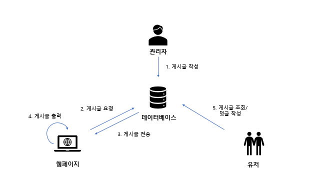
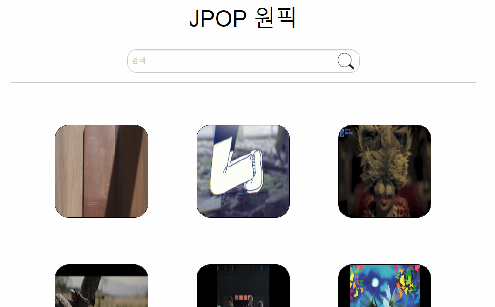
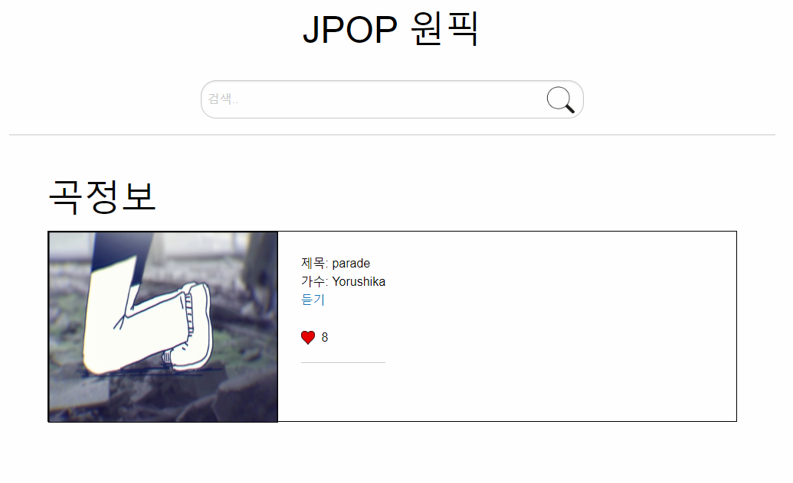
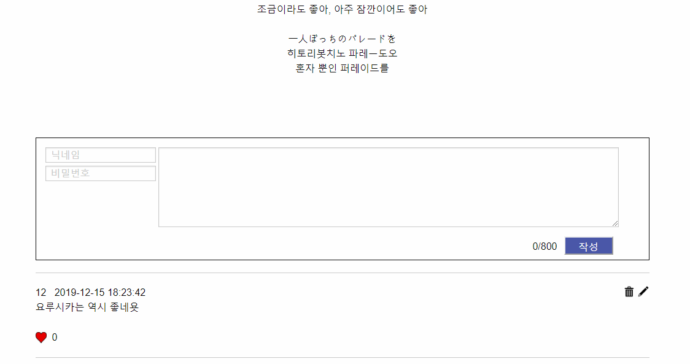

# [J-POP OnePick](http://bso11246.dothome.co.kr/sku-web/index.php) 
관리자 취향대로 고른 J-pop에 대한 정보를 제공해주는 사이트입니다.

## 주요기능
1. 곡검색
데이터베이스에 접근해 사용자 입력에 대한 조회를 하고 그에 맞는 곡 정보를 화면에 표시합니다.
2. 게시글 출력
데이터베이스에 접근해 게시글에 표시할 정보를 가져와 화면에 표시합니다.
3. 곡 정보 출력
그리드 형식으로 이미지와 간단한 카드를 이용해서 곡 정보를 출력합니다.
4. 덧글 작성/수정/제거
각 게시글에 달린 덧글을 데이터베이스에서 가져와 화면에 표시합니다. 수정과 제거는 웹서버에서 요청하면 데이터베이스에서 이루어집니다.

## 전체구성도

 

  

## 메인화면

 

  

## 곡 정보 화면

 

  

## 코멘트

 

  

